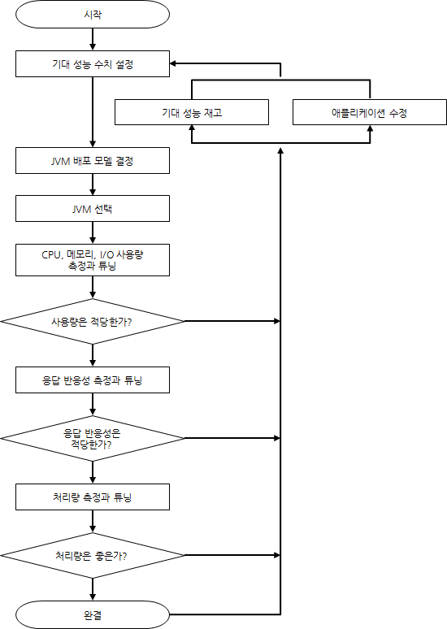
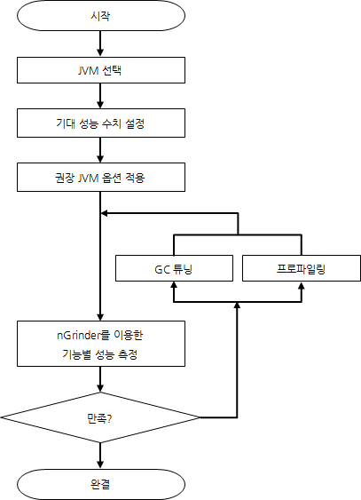
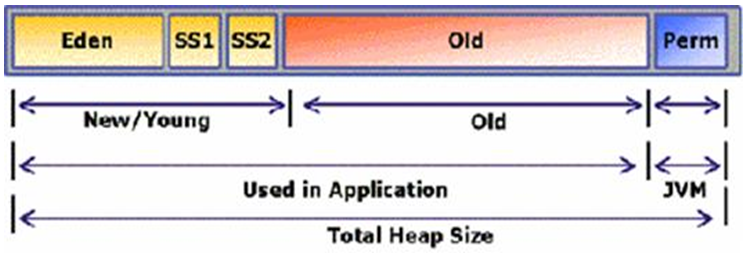

# JVM 성능 튜닝
## 튜닝을 위한 기본 내용
### 튜닝 절차


### 인터넷 서비스 자바 애플리케이션 권장 튜닝 절차


### JVM 선택
동일 조건이라면 32bit JVM을 선택하는 것이 좋다


### Garbege Collection의 종류
Minor GC는 Young영역에 발생하는 GC를 나타냅니다

Full GC는 Old영역에 발생하는 GC를 나타냅니다
Full GC는 속도가 느리고 성능에 아주 큰 영향이 있습니다. 이유는 Full GC가 수행되는 동안 자바 애플리케이션의 멈춤현상이 동행되기 때문입니다.

### 자바 VM 메모리 구조

자바 VM은 힙을 세개의 영역으로 나누어 사용한다.
- New/Young 영역 : 새로 생성된 객체를 저장
- Old 영역 : 만들어진지 오래된 객체를 저장
- Permanent 영역 : JVM클래스와 메서드 객체를 저장

New 영역은 
- Eden : 모든 새로 만들어진 객체를 저장
- Survivor Space 1, Survivor Space 2 : Old 영역으로 넘어가기 전 객체들이 저장되는 공간

### -verbosegc 옵션
- XX:+PrintGCDetails
- XX:+PrintGCTimeStamps
- XX:+PrintHeapAtGC
- XX:+PrintGCDateStamps (from JDK 6 update 4)

-verbosegc 옵션을 사용하면 Minor GC가 발생할 때마다 다음과 같은 형식의 결과를 볼 수 있다.
```
[GC [<collector>: <starting occupancy1=""> -> <ending occupancy1="">, <pause time1=""> secs] <starting occupancy3=""> -> <ending occupancy3="">, <pause time3=""> secs]
 </pause></ending></starting></pause></ending></starting></collector>
```
verbosegc 옵션 사용 결과 형식의 항목
- Collector	: Minor GC를 위해 사용하는 컬렉터의 이름
- starting occupancy1 : GC 전 Young 영역의 크기
- ending occupancy1 : GC 후 Young 영역의 크기
- pause time1 : Minor GC를 위해 Java 애플리케이션이 수행을 멈춘 시간
- starting occupancy3 : GC 전 전체 힙 크기
- ending occupancy3 : GC 후 전체 힙 크기
- pause time3 : Major GC를 포함하여 전체 힙 GC를 위해 Java 애플리케이션 수행을 멈춘 시간

다음은 Minor GC에 대한 -verbosegc 옵션 출력 결과의 예이다.
```
[GC [DefNew: 4032K->64K(4032K), 0.0429742 secs] 9350K->7748K(32704K), 0.0431096 secs]
[GC [DefNew: 4032K->64K(4032K), 0.0403446 secs] 11716K->10121K(32704K), 0.0404867 secs]
```

다음은 Full GC가 발생했을 때 출력 결과의 예이다.
```
[Full GC [Tenured: 3485K->4095K(4096K), 0.1745373 secs] 61244K->7418K(63104K), [Perm : 10756K->10756K(12288K)], 0.1762129 secs] [Times: user=0.19 sys=0.00, real=0.19 secs]
```

## Garbage Collection 튜닝 방법
GC 튜닝은 가장 마지막에 하는 작업입니다.

### Old 영역으로 넘어가는 객체의 수 최소화하기
 Old 영역의 GC는 New 영역의 GC에 비하여 상대적으로 시간이 오래 소요되기 때문에 Old 영역으로 이동하는 객체의 수를 줄이면 Full GC가 발생하는 빈도를 많이 줄일 수 있다

### Full GC 시간 줄이기
Full GC의 실행 시간은 상대적으로 Minor GC에 비하여 길다. 그래서 Full GC 실행에 시간이 오래 소요되면(1초 이상) 연계된 여러 부분에서 타임아웃이 발생할 수 있다. 그렇다고 Full GC 실행 시간을 줄이기 위해서 Old 영역의 크기를 줄이면 자칫 OutOfMemoryError가 발생하거나 Full GC 횟수가 늘어난다. 반대로 Old 영역의 크기를 늘리면 Full GC 횟수는 줄어들지만 실행 시간이 늘어난다.
### GC의 성능을 결정하는 옵션

GC 튜닝 시 기본적으로 학인해야 하는 JVM 옵션

구분 |옵션|설명
--------- | ---------| ---------
힙(heap) 영역 크기	|-Xms|JVM 시작 시 힙 영역 크기
| |-Xmx	| 최대 힙 영역 크기
New 영역의 크기|-XX:NewRatio|New영역과 Old 영역의 비율
| |-XX:NewSize|New영역의 크기
| |-XX:SurvivorRatio|Eden 영역과 Survivor 영역의 비율

 GC 튜닝을 할 때 자주 사용하는 옵션은 -Xms 옵션, -Xmx 옵션, -XX:NewRatio 옵션이다. 특히 -Xms 옵션과 -Xmx 옵션은 필수로 지정해야 하는 옵션이다. 그리고 NewRatio 옵션을 어떻게 설정하느냐에 따라서 GC 성능에 많은 차이가 발생한다.

### GC 방식
Old 영역은 기본적으로 데이터가 가득 차면 GC를 실행한다. GC 방식에 따라서 처리 절차가 달라지므로, 어떤 GC 방식이 있는지 살펴보면 이해가 쉬울 것이다.

구분 |옵션|설명
--------- | ---------| ---------
Serial GC|-XX:+UseSerialGC|  
Parallel GC|"-XX:+UseParallelGC | 
| | -XX:ParallelGCThreads=value"| 
Parallel Compacting GC|-XX:+UseParallelOldGC| 
CMS GC|"-XX:+UseConcMarkSㄹweepGC
| |-XX:+UseParNewGC
| |-XX:+CMSParallelRemarkEnabled
| |-XX:CMSInitiatingOccupancyFraction=value 
| |-XX:+UseCMSInitiatingOccupancyOnly"| 
G1|"-XX:+UnlockExperimentalVMOptions | JDK 6에서는 두 옵션을 반드시 같이 사용해야 함
| |-XX:+UseG1GC"|

운영 서버에서 절대 사용하면 안 되는 방식이 Serial GC다. Serial GC는 데스크톱의 CPU 코어가 하나만 있을 때 사용하기 위해서 만든 방식이다. Serial GC를 사용하면 애플리케이션의 성능이 많이 떨어진다.
- Serial GC
> 적은 메모리와 CPU 코어 개수가 적을 때 적합한 방식이다.
- Parallel GC
> 메모리가 충분하고 코어의 개수가 많을 때 유리
- Parallel Old GC(Parallel Compacting GC)
> DK 5 update 6부터 제공한 GC 방식이다. 앞서 설명한 Parallel GC와 비교하여 Old 영역의 GC 알고리즘만 다르다. 
- Concurrent Mark & Sweep GC(이하 CMS)
>  stop-the-world 시간이 짧다는 장점\
> 다른 GC 방식보다 메모리와 CPU를 더 많이 사용한다.\
> Compaction 단계가 기본적으로 제공되지 않는다.\
> 따라서, CMS GC를 사용할 때에는 신중히 검토한 후에 사용해야 한다. 그리고 조각난 메모리가 많아 Compaction 작업을 실행하면 다른 GC 방식의 stop-the-world 시간보다 stop-the-world 시간이 더 길기 때문에 Compaction 작업이 얼마나 자주, 오랫동안 수행되는지 확인해야 한다.
- G1(Garbage First) GC
> G1 GC의 가장 큰 장점은 성능이다. 지금까지 설명한 어떤 GC 방식보다도 빠르다. 하지만, JDK 6에서는 G1 GC를 early access라고 부르며 그냥 시험삼아 사용할 수만 있도록 한다. 그리고 JDK 7에서 정식으로 G1 GC를 포함하여 제공한다.
> 그러나 JDK 7을 실서비스에서 사용하려면 많은 검증 기간(1년은 필요하다는 생각이다)을 거쳐야 할 것으로 보이기 때문에, G1 GC를 당장 사용하고 싶어도 더 기다리는 것이 좋다는 것이 개인적인 생각이다. JDK 6에서 G1 GC를 적용했다가 JVM Crash가 발생했다는 말도 몇 번 들었기에 더더욱 안정화될 때까지 기다리는 것이 좋겠다.
#### Default GC
- Java 7 - Parallel GC
- Java 8 - Parallel GC
- Java 9 - G1 GC

### GC 튜닝의 절차
1. GC 상황 모니터링
2. 모니터링 결과 분석 후 GC 튜닝 여부 결정
GC 수행에 소요된 시간이 0.1~0.3초 밖에 안 된다면 굳이 GC 튜닝에 시간을 낭비할 필요는 없다. 하지만 GC 수행 시간이 1~3초, 심지어 10초가 넘는 상황이라면 GC 튜닝을 진행
3. GC 방식/메모리 크기 지정
서버가 여러 대이면 여러 대의 서버에 GC 옵션을 서로 다르게 지정해서 GC 옵션에 따른 차이를 확인하는 것이 중요
4. 결과 분석
#### GC 상황 모니터링 및 결과 분석하기
```
$ jstat -gcutil 20213 5s
S0C S1C S0U S1U EC EU OC OU PC PU YGC YGCT FGC FGCT GCT  
3008.0 3072.0 0.0 1511.1 343360.0 46383.0 699072.0 283690.2 75392.0 41064.3 2540 18.454 4 1.133 19.588  
3008.0 3072.0 0.0 1511.1 343360.0 47530.9 699072.0 283690.2 75392.0 41064.3 2540 18.454 4 1.133 19.588  
3008.0 3072.0 0.0 1511.1 343360.0 47793.0 699072.0 283690.2 75392.0 41064.3 2540 18.454 4 1.133 19.588  

```
이 항목들이 중요한 이유는 GC를 수행하는데 시간이 얼마나 소요되었는지 알 수 있기 때문이다.

위의 예에서 YGC는 217이고 YGCT가 0.928이므로, 산술평균을 내면 하나의 Young GC당 4ms(0.004초) 정도의 시간이 필요했다는 것을 알 수 있다. 마찬가지로 평균 Full GC 시간은 33ms임을 알 수 있다.

하지만 산술평균은 실제 GC 문제를 분석하는 데 도움이 되지 않는 경우가 많다. GC 수행 시간 편차가 심할 수 있기 때문이다(다시 말해서 0.067초의 Full GC 시간 중 한 번은 1ms, 다른 한 번은 57ms가 소요되었을 수도 있다). 산술평균이 아닌 개별적인 GC 시간을 파악하려면 -verbosegc 옵션을 이용하는 것이 더 유리하다.

## JVM 튜닝
### JVM 옵션
전체 힙 사이즈의 크기 지정만큼 New 영역의 크기 지정 또한 중요하다. XX:NewRatio 옵션을 이용해 전체 힙 크기 중 New 크기의 비율을 지정하거나 XX:NewSize 옵션을 사용해 원하는 크기만큼의 New 영역 크기를 지정하는 것이 좋다. 대부분의 객체는 생존 시간이 길지 않기 때문에 New 영역 크기 지정이 중요해진다. 웹 애플리케이션에서 캐시 데이터를 제외한 대부분의 객체는 HttpRequest에 대한 HttpResponse가 만들어지는 시간에 생성된다. 보통 이 시간은 1초를 넘지 않기에 객체의 생존 시간도 1초가 되지 않는다. 만약 New 영역의 크기가 크지 않다면 새로 생성되는 객체의 자리를 위해 Old 영역으로 이동돼야 하고 Old 영역에 대한 GC 비용은 New 영역에 대한 GC 비용보다 상당히 크기 때문에 충분한 New 영역 크기를 잡아줘야 한다.

#### 모니터링 후 옵션변경 예시

종류	|옵션
------ |-------
동작 모드	|-sever
전체 힙 크기	|-Xms와 –Xmx의 값을 같게
New 영역 크기	|-XX:NewRatio 2~4 정도의 값
| |-XX:NewSize=?
| |–XX:MaxNewSize=?
| |NewRatio 대신 NewSize를 지정하는 것도 좋다.
Perm 크기	|-XX:PermSize=256m
| |-XX:MaxPermSize=256m
| |성능에 영향을 미치지 않으므로 동작에 문제가 없을 정도만 지정한다.
GC 로그	|-Xloggc:$CATALINA_BASE/logs/gc.log
| |-XX:+PrintGCDetails
| |-XX:+PrintGCDateStamps
| |GC로그를 남기는 것은 특별히 Java 애플리케이션 수행 성능에 영향을 미치지 않는다. 가급적이면 GC 로그를 남기는 것이 좋다.
GC 알고리즘	|-XX:+UseParNewGC
| |-XX:+CMSParallelRemarkEnabled
| |-XX:+UseConcMarkSweepGC
| |-XX:CMSInitiatingOccupancyFraction=75
| |일반적으로 권할만한 설정일 뿐이다. 애플리케이션 특성에 따라 다른 선택이 더 좋을 수 있다.
OOM 에러 발생 시 힙 덤프 생성	|-XX:+HeapDumpOnOutOfMemoryError
| |-XX:HeapDumpPath=$CATALINA_BASE/logs
OOM 발생 이후 조치	|-XX:OnOutOfMemoryError=$CATALINA_HOME/bin/stop.sh 또는
| |-XX:OnOutOfMemoryError=$CATALINA_HOME/bin/restart.sh 힙 덤프를 남긴 뒤, 관리 정책에 맞게 적합한 동작을 취할 수 있도록 한다.
 * OOM : Out Of Memory
 
## 성능 튜닝 도구
### 프로파일링 도구
- Eclipse TPTP: 현재는 개발이 중단된 상태이나 공개된 프로파일링 도구 중 꽤 쓸만한 편이다.
- JVisualVM: JDK에 포함된 기본 도구로 GC 분석, 힙 덤프 및 스레드 덤프 생성, 스레드 모니터링 등의 다양한 용도로 사용할 수 있다. 내장된 샘플러 도구를 통해 간단한 프로파일링이 가능하다.
### 성능 측정용 도구
성능 측정용 도구로는 HP의 LoadRunner가 가장 유명하다. 그러나 상용제품으로 꽤 비싼 가격이므로 본문에서 언급한 nGrinder를 소개한다.
- nGrinder: NHN에서 제작해 공개한 오픈소스로 기존 오픈소스 성능 측정 도구인 Grinder의 불편한 점을 보완하고 통합 환경을 제공한다.
### GC 로그 분석 도구
- Hpjmeter: HP에서 개발 배포하는 자바 성능 분석 도구로 Heap Dump 분석, 모니터링 등의 여러 기능을 가지고 있는 멀티툴이지만 GC 로그를 매우 깔끔하게 보여주므로 GC 로그 분석기로도 사용하기 좋다.
- GC Viewer: 오픈소스로 개발된 GC 로그 뷰어다.
- IBM Pattern Modeling and Analysis Tool for Java Garbage Collector: IBM developerworks에서 개발해 공개한 GC 로그 뷰어다.
- JVisualVM의 VisualGC plugin: JVisualVM 내에 탑재된 GC 모니터링 플러그인이다. 현재의 GC 동작을 모니터링하기에 유용하다.
### 힙 덤프 분석 도구
Stop the World 시간이 길거나 기타 이유로 성능이 나쁘다고 여겨질 때 힙 덤프를 얻어 분석하는 것도 효과적이다.
- Eclipse Memory Analyzer: 흔히 이클립스 MAT이라고 부르는 이클립스 기반의 메모리 분석기다. 이클립스 플러그인으로 설치해 사용할 수도 있고 이클립스 RCP로 된 스탠드 얼론 프로그램으로 사용할 수도 있다.
- IBM HeapAnalyzer: IBM developerworks에서 개발해 공개하고 있는 힙 메모리 분석기다.

## jstat
jstat은 HotSpot JVM에 있는 모니터링 도구이다. jstat 이외에 HotSpot JVM 모니터링 도구로는 jps와 jstatd가 있다. Java 애플리케이션을 모니터링할 때에는 이 세 개의 도구를 모두 사용해야 할 경우도 있다.

제공 기능
- GC 수행 정보를 보는 기능
- 클래스로더 수행 정보
- Just-in-Time 컴파일러 수행 정보
```
jstat [options] [process-id] [interval]

```
```
$ jstat -gcutil 20213 5s
  S0     S1     E      O      M     CCS    YGC     YGCT    FGC    FGCT     GCT   
  0.00  78.27  35.08   6.11  98.05  95.11      3    0.057     1    0.029    0.086
  0.00  78.27  35.08   6.11  98.05  95.11      3    0.057     1    0.029    0.086
  0.00  78.27  35.08   6.11  98.05  95.11      3    0.057     1    0.029    0.086
  0.00  78.27  35.08   6.11  98.05  95.11      3    0.057     1    0.029    0.086

```
GC 관련 jstat 옵션

옵션 |기능
--------- | ---------
gc	|각 힙(heap) 영역의 현재 크기와 현재 사용량(Eden 영역, Survivor 영역, Old 영역등), 총 GC 수행 횟수, 누적 GC 소요 시간을 보여 준다.
gccapactiy	|각 힙 영역의 최소 크기(ms), 최대 크기(mx), 현재 크기, 각 영역별 GC 수행 횟수를 알 수 있는 정보를 보여 준다. 단, 현재 사용량과 누적 GC 소요 시간은 알 수 없다.
gccause	|-gcutil 옵션이 제공하는 정보와 함께 마지막 GC 원인과 현재 발생하고 있는 GC의 원인을 알 수 있는 정보를 보여 준다.
gcnew	|New 영역에 대한 GC 수행 정보를 보여 준다.
gcnewcapacity	|New 영역의 크기에 대한 통계 정보를 보여 준다.
gcold	|Old 영역에 대한 GC 수행 정보를 보여 준다.
gcoldcapacity	|Old 영역의 크기에 대한 통계 정보를 보여 준다.
gcpermcapacity	|Permanent 영역에 대한 통계 정보를 보여 준다.
gcutil	|각 힙 영역에 대한 사용 정도를 백분율로 보여 준다. 아울러 총 GC 수행 횟수와 누적 GC 시간을 알 수 있다.

jstat의 옵션에 따른 칼럼 정보

칼럼 | 설명 
--------- | ---------
S0|Survivor 0 영역의 현재 크기
S1|Survivor 1 영역의 현재 크기
E |Eden 영역의 현재 크기
O |Old 영역의 현재 크기
P |Permanent영역의 현재 크기
YGC	|Young Generation의 GC 이벤트 발생 횟수	
YGCT	|Yong Generation의 GC 수행 누적 시간
FGC	|Full GC 이벤트가 발생한 횟수
FGCT	|Full GC 수행 누적 시간
GCT	|전체 GC 수행 누적 시간


## (Java) VisualVM + Visual GC
Java VisualVM은 Oracle JDK가 제공하는 GUI 프로파일링/모니터링 툴이다.

JDK 포함 버전이 아니라 홈 페이지에서 Visual VM을 내려 받을 수도 있다. 편의상 이 둘을 구분하기 위해 JDK 포함 버전은 Java VisualVM(jvisualvm)이라고 부르고, 홈 페이지에서 내려 받는 버전을 Visual VM(visualvm)이라고 부른다. 둘의 기능이 완벽히 동일한 것은 아니고, 플러그인 설치 등에서 약간의 기능 차이가 있다. 필자는 개인적으로는 별도로 내려 받는 Visual VM을 선호하는 편이다.

Visual VM을 가동한 후 왼쪽의 패널에서 모니터링하려는 애플리케이션을 선택하면, 다음과 같은 Monitoring 탭을 찾을 수 있다. 이 Monitoring 탭에서 GC와 힙에 대한 개략적인 정보를 볼 수 있다.

## HPJMeter

HPJMeter는 -verbosegc 옵션의 출력 결과 분석을 쉽게 해 준다. jstat에 대응하는 GUI 애플리케이션이 Visual GC라면 HPJMeter는 -verbosegc 옵션에 대응하는 GUI 애플리케이션이라고 할 수 있다. 물론 GC 분석 기능은 HPJMeter가 제공하는 기능 중 일부일 뿐이다. HPJmeter는 HP에서 제작한 퍼포먼스 모니터링 도구로, HP-UX뿐만 아니라, Linux나 Microsoft Windows에서도 사용할 수 있다.


## 용어 

### Stop The World
Full GC로 인해 애플리케이션이 멈추는 Stop The World 현상
### SPARC
SPARC은 확장 가능한 아키텍쳐(Scalable Processor ARChitecture)의 줄임 말

## References
<https://d2.naver.com/helloworld/6043>\
<http://drkein.tistory.com/95>\
<https://d2.naver.com/helloworld/184615>\
<https://d2.naver.com/helloworld/1329>